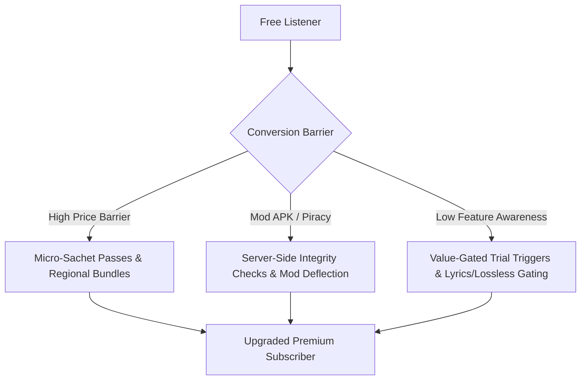

# 🎵 Spotify PM Deck: Improving Free-to-Premium Conversion Rate (CR)

[](https://opensource.org/licenses/MIT)
[]()
[]()
[]()

A comprehensive Product Management project focused on analyzing Spotify's freemium funnel, user behavior, price sensitivity, and feature gating to drive higher **Free-to-Premium Conversion Rates (CR)** in price-sensitive emerging markets.

---

## 📌 Executive Summary

Spotify's freemium strategy has driven massive Monthly Active User (MAU) growth globally. However, in price-sensitive and emerging markets (such as India), converting free tier listeners into paying Premium subscribers presents significant friction. High ad tolerance, alternative free media platforms (e.g., YouTube), piracy/Mod APK adoption, and perceived high subscription costs act as primary conversion barriers.

This project delivers an end-to-end product strategy to unlock higher conversion rates through data-backed user segmentation, micro-tiered pricing, feature gating optimization, and anti-piracy deflection.

---

## 📊 Primary & Secondary Research Findings

### 1. Primary Survey Data Insights ($N = 177$)
From our primary quantitative research survey analyzing music streaming consumption habits:

* **Market Share (App Usage Preference)**:
  * **Spotify**: **65.8%** (Dominant platform among surveyed users)
  * **YouTube Music**: **13.2%**
  * **Wynk Music**: **5.3%**
  * **Amazon Music / JioSaavn**: **3.4%** each
  * **Apple Music / Resso**: **1.3%** each

* **User Tier Distribution**:
  * **Free Tier Users**: **64.5%**
  * **Active Paid Subscribers**: **26.3%**
  * **Lapsed Paid Subscribers**: **5.3%**
  * **Mod APK / Piracy Users**: **3.9%**

* **Top Reasons Free Users Haven't Converted**:
  1. **High Ad Tolerance & Satisfaction with Free Features (35.5%)**: Free tier fulfills basic music streaming needs; users prefer listening to periodic ads over paying.
  2. **Piracy & Modded Applications (23.7%)**: Users leverage modified APKs or YouTube downloaders to bypass ads and skip limits without paying.
  3. **Price Sensitivity & Cost Perception (14.5%)**: Monthly subscription prices are perceived as high for non-earning or student demographics.
  4. **Content Gaps & Regional Catalog Licensing**: Catalog dropouts (e.g., specific regional or Zee Music catalog licensing gaps) push users to YouTube.

---

## 💡 Proposed Product Solutions & Growth Interventions



1. **Sachet & Micro-Subscription Pricing**:
   - Introduce low-friction daily/weekly access passes and context-based sachet pricing catered to student and young professional demographics.
2. **Optimized Feature Gating vs. User Frustration**:
   - Rebalance gating mechanics away from high-frustration UX (e.g., total shuffle lockouts) toward high-value premium capabilities (high-fidelity audio, offline downloading, multi-device active sessions, synced lyrics).
3. **Mod APK Deflection & Win-Back Funnel**:
   - Implement server-side client integrity attestation to convert Mod APK users via targeted in-app upgrade promotions instead of outright account bans.
4. **Catalog & Search Enhancement**:
   - Dynamic fallback search integrations that bridge local catalog licensing gaps and highlight exclusive podcast/artist content.

---

## 📈 Key Performance Indicators (KPIs)

| Metric Type | KPI Metric | Target Goal |
| :--- | :--- | :--- |
| **Primary Metric** | **Free-to-Premium Conversion Rate (CR %)** | Increase CR by **+2.5% to +4.0%** YoY |
| **Secondary Metric** | **Average Revenue Per User (ARPU)** | Maintain stable ARPU while introducing sachet tiers |
| **Retention** | **D30 / D90 Subscriber Retention** | $\ge 82\%$ retention on new micro-tier conversions |
| **Guardrail Metric** | **Free MAU Churn & Daily Listening Time** | Ensure daily minutes listened per user does not decline |

---

## 📁 Repository Structure

```gfm
├── Spotify_Deck.pdf                      # Comprehensive Product Strategy Presentation Deck
├── Music Streaming Apps Survey .xlsx     # Primary quantitative survey raw dataset & responses
├── Spotify Research.docx                 # Secondary research notes, industry benchmarks & links
├── README.md                             # Detailed project overview and documentation
└── LICENSE                               # MIT License
```

---

## 📄 License

This repository is licensed under the **[MIT License](LICENSE)**.
